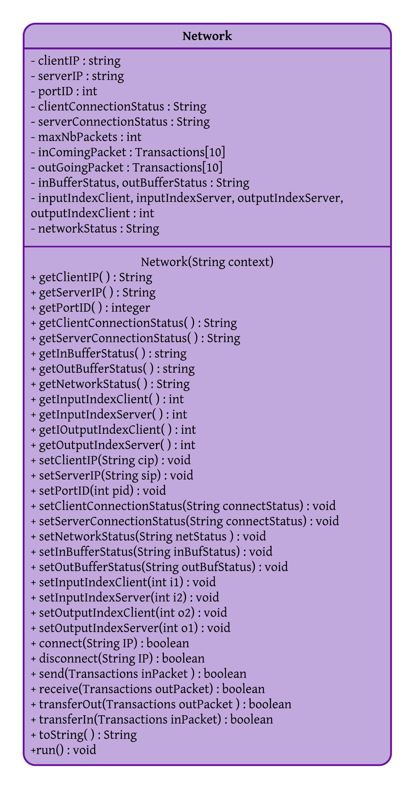

# Small Bank Application Simulator
For this project, my main objective was to apply the practice of multi-threading features of Java. I was tasked with implementing a client-server application to process banking transactions like withdrawals and deposits. 
testeststststs
## How is it supposed to work?
Although the scheduler is responsible for handling mult-threading and ressource management, this program was meant to follow a certain logical order of events. `Client` threads' last operation is to receive transactions which happens before the `server` thread processes the last transaction. The `client` cant receive an account if it has not been processed. Therefore, the **`server` thread always has to end after the `client` thread**. This is required because if the `server` thread ended before the `client` thread we wouldn't be able to guarantee successful processing.

### The Network Class:
The `Network` class provides the infrastructure to allow the `client` and the `server` to process the `transactions`. The `client` and the `server` need to be connected using to the network prior to an exchange (by calling the `connect()` method). The `Network` class also implements an input buffer `inComingPacket[]` and an output buffer `outGoingPacket[]` to receive transactions from the client and to return updated transactions to the client. The capacity of these buffers are 10 elements, and the network indicates whether the buffer is full or empty.\

### The Client Class:
The Client class reads all the transactions from a file [`transaction.txt`](transaction.txt) and saves them in an array `transaction[]`. The Transaction class contains all the required information which is described in the next section.
Using the send() method of Network class the client transfers the transactions
to the network input buffer and it yields the cpu in case the network input buffer
is full.
Also, using the receive() method of Network class the client retrieves the
updated transactions from the network output buffer and yields the cpu in case
the buffer is empty. Each updated transaction received is displayed immediately
on the console

### Server class. 
