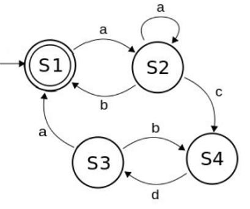

## [Student Data](student_data.pl)
Knowledge base that includes data about students (name, student ID, courses enrolled in). Additional queries to return a list of courses taken by each student, as well as unique courses taken by the group.

## [FSM](fsm.pl)
Representation of this FSM in prolog. It can be queried to determine whether the sequence of `a a b` is accepted by the machine for example.

## [Second half of a list](list_half.pl)
Prolog rule that returns the second half of a given list.

## [Lucas sequence](lucas_firstN.pl)
Prolog query with arity 2 to return the first `n` numbers of a Lucas sequence in a list.
